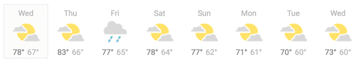

<h1 align="center">
  
</h1>

## **<h2 align="center">WeatherApp ☁️☀️</h2>**

 

# **Demonstration of the application - Web Layout** 💻

  

 

# **Challenge** 💻
Display a 5-day weather forecast, where each day shows the high and low temperatures, and an image for sunny/rainy/cloudy/snowy. Use fake, hard-coded data until you’ve got everything rendering correctly.

  

You might notice that the “days” look a lot like social cards…

For added practice, here are a few ways you could expand on the app:

Add the ability to click on a day, and see its hourly forecast. You can just maintain the current view in the top-level App state.
Add React Router to the project (npm install react-router) and follow the quick start guide here to add routes, such that / shows the 5-day forecast, and /[name-of-day] shows the hourly forecast for a particular day.
Sign up for a free API key from Open Weather Map, fetch a real 5-day forecast, and feed that data into your app.
Want to get really fancy? Add a graphics library like vx and follow the examples here to add a graph of the temperature over the course of a week or day.
You can see how this app starts off simple, but can be expanded at will to increase the challenge and the learning.

